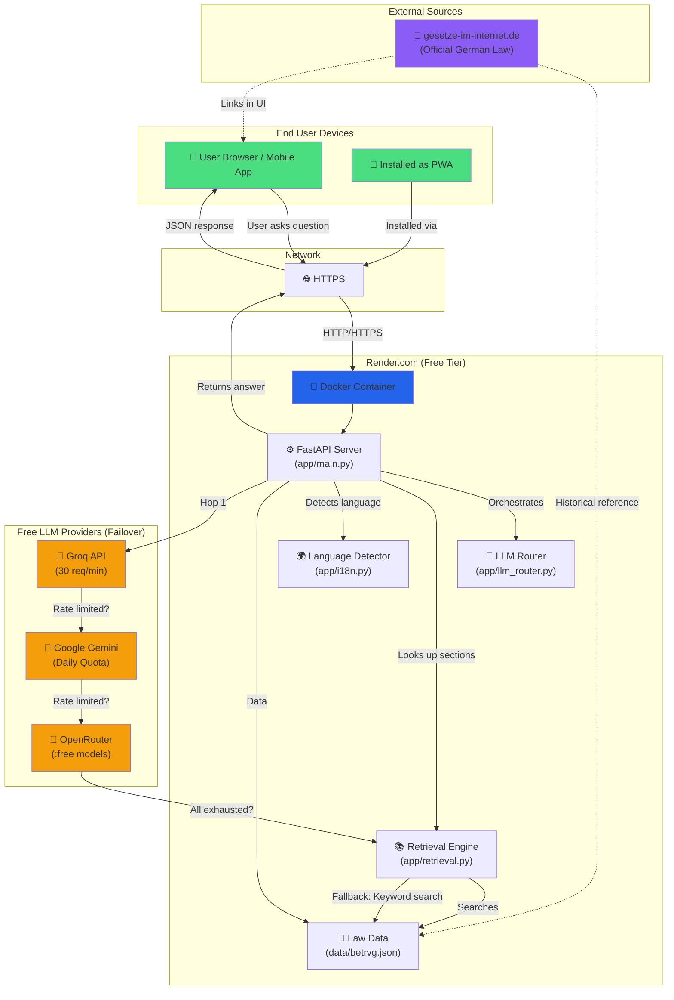
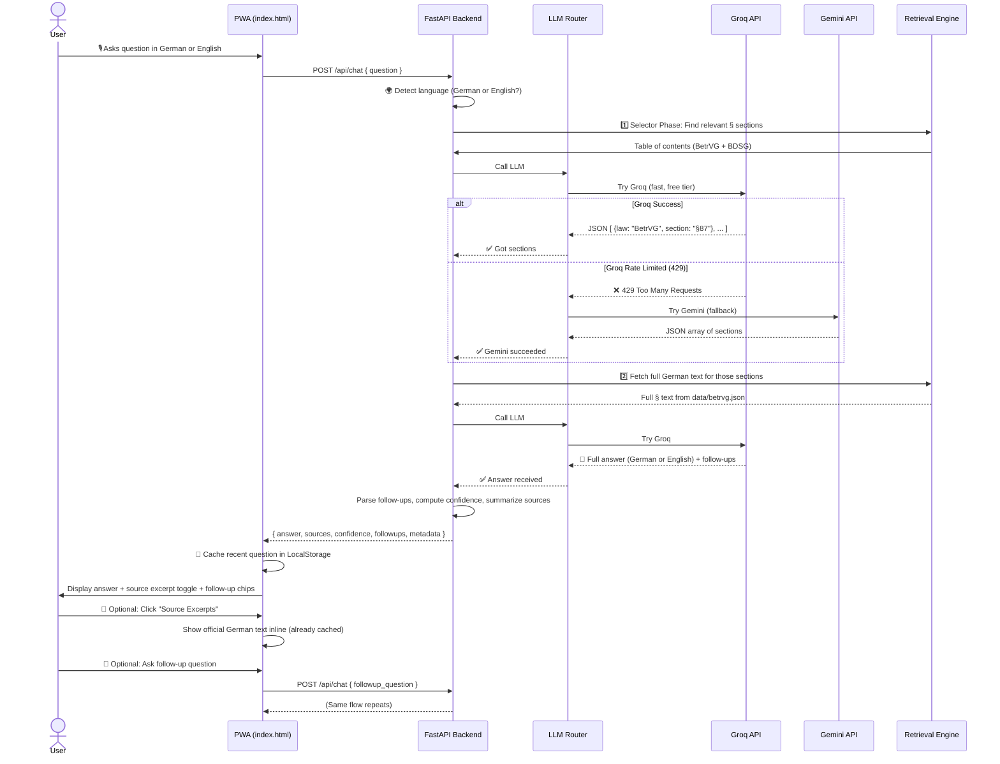
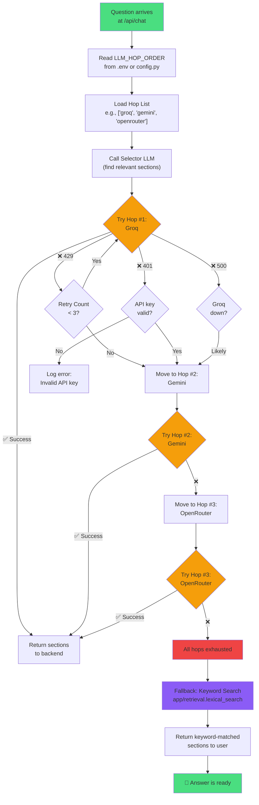
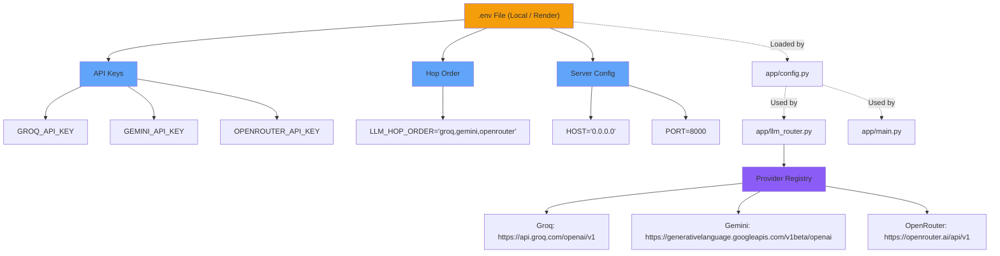
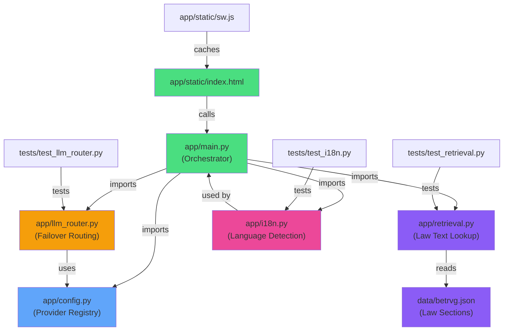
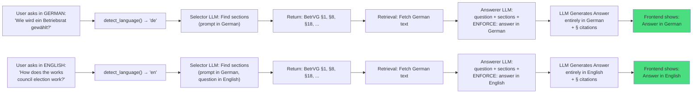
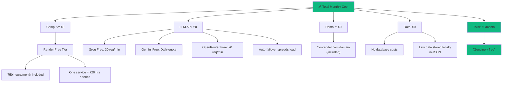

# Worker Council Assistant — Architecture Diagram

## System Architecture Overview

---

## Request/Response Flow

---

## Data Flow: Question → Answer

```mermaid
graph LR
    A["User Question<br/>German or English"] --> B["Language Detect<br/>app/i18n.py"]
    
    B -->|German| C["Keep in German"]
    B -->|English| C
    
    C --> D["Selector Prompt<br/>to LLM"]
    D --> E["LLM Returns:<br/>- law name<br/>- § number"]
    
    E --> F["Retrieval Engine<br/>app/retrieval.py"]
    F --> G["Load from<br/>data/betrvg.json"]
    
    G --> H["Answerer Prompt<br/>to LLM<br/>+ Context"]
    H --> I["LLM Generates<br/>Answer<br/>in Same Language"]
    
    I --> J["Parse Metadata<br/>- Citations<br/>- Follow-ups<br/>- Confidence"]
    
    J --> K["Return to Frontend<br/>JSON Response"]
    K --> L["User Sees:<br/>- Answer Text<br/>- § Citations<br/>- Follow-ups<br/>- Source Toggle"]
    
    style A fill:#4ade80
    style B fill:#60a5fa
    style C fill:#60a5fa
    style D fill:#f59e0b
    style E fill:#f59e0b
    style F fill:#8b5cf6
    style G fill:#8b5cf6
    style H fill:#f59e0b
    style I fill:#f59e0b
    style J fill:#ec4899
    style K fill:#06b6d4
    style L fill:#4ade80
```

---

## Frontend Architecture (PWA)

```mermaid
graph TB
    A["index.html<br/>(Single-Page App)"]
    
    A --> B["Static Assets"]
    B --> B1["manifest.json<br/>(PWA metadata)"]
    B --> B2["sw.js<br/>(Service Worker)"]
    B --> B3["icons/"]
    B3 --> B3a["icon-192.png"]
    B3 --> B3b["icon-512.png"]
    B3 --> B3c["apple-touch-icon.png"]
    
    A --> C["JavaScript Logic"]
    C --> C1["Initialize App"]
    C --> C2["Register Service Worker"]
    C --> C3["Handle PWA Install Prompt"]
    C --> C4["Send Questions to /api/chat"]
    C --> C5["Display Answers + Metadata"]
    
    B2 --> D["Service Worker"]
    D --> D1["Cache Strategy"]
    D1 --> D1a["HTML: Network First"]
    D1 --> D1b["CSS/JS: Cache First"]
    D1 --> D1c["Images: Cache First"]
    
    D --> D2["Background Sync"]
    D2 --> D2a["Queue questions if offline"]
    D2 --> D2b["Sync when online"]
    
    D --> D3["Check for Updates"]
    D3 --> D3a["Call reg.update() on load"]
    D3 --> D3b["Refresh if new version"]
    
    A --> E["Local Storage"]
    E --> E1["Recent Questions"]
    E2["Device-local only"]
    E --> E1
    E --> E2
    
    A --> F["UI Components"]
    F --> F1["Hero Section<br/>(Landing Page)"]
    F --> F2["Chat Bubbles<br/>(User + Bot)"]
    F --> F3["Source Excerpt Toggle"]
    F --> F4["Follow-up Chips"]
    F --> F5["Recent Panel"]
    F --> F6["Sources Panel"]
    F --> F7["Install Banner"]
    
    style A fill:#4ade80
    style B fill:#60a5fa
    style C fill:#60a5fa
    style D fill:#f59e0b
    style E fill:#8b5cf6
    style F fill:#ec4899
```

---

## LLM Provider Failover Logic

---

## Deployment Pipeline

```mermaid
graph LR
    A["Local Git Repo"] -->|git push| B["GitHub"]
    
    B -->|Webhook Trigger| C["Render.com<br/>Detection"]
    
    C --> D["Read render.yaml"]
    D --> E["Build Docker Image"]
    E --> F["Install Python deps<br/>from Dockerfile"]
    F --> G["Copy app code"]
    G --> H["Start FastAPI server"]
    
    H --> I["🟢 Service Live<br/>on Public URL"]
    
    I --> J["Users visit URL"]
    J --> K["Download index.html"]
    K --> L["Download sw.js +<br/>other assets"]
    L --> M["💾 Service Worker<br/>caches everything"]
    
    M --> N["User clicks 'Install'"]
    N --> O["📱 App added to<br/>home screen / start menu"]
    
    O --> P["🚀 Users can now ask questions"]
    
    style A fill:#4ade80
    style B fill:#4ade80
    style C fill:#60a5fa
    style I fill:#10b981
    style P fill:#10b981
```

---

## Environment & Configuration

---

## Module Dependencies

---

## Bilingual Flow Example

---

## Cost Breakdown (Monthly)

---

This comprehensive visual guide shows:
- **System architecture** (end-to-end)
- **Request/response flow** (sequence)
- **Data flow** (question to answer)
- **Frontend PWA structure**
- **LLM failover logic**
- **Deployment pipeline**
- **Configuration & dependencies**
- **Bilingual handling**
- **Cost model** (€0)

All diagrams are Mermaid-compatible and render in GitHub, markdown viewers, and documentation sites.
